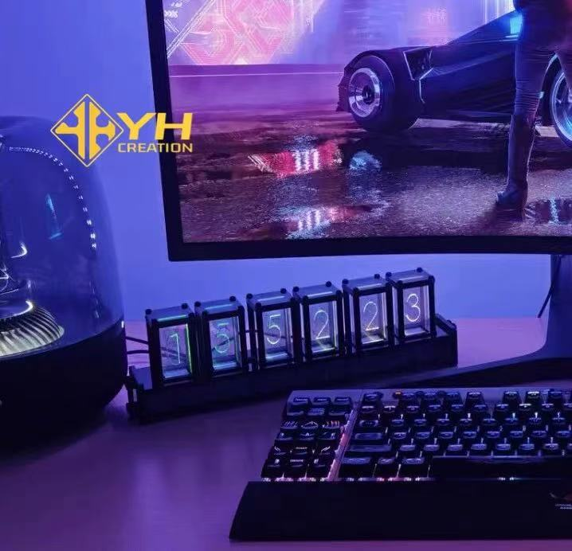

# Seven-segment-timer_SID53072569_IDEA9103_tut9_Final-individual

## User Guide  
##### A simple timer — just click to use it as usual!  
##### If you want to change the style of each segments, simply refresh the page to get a different digit line style.

##### ⚠️Note: Although this code has been optimized for screen adaptability, due to the complex calculations required each time the array is recalculated, avoid quickly dragging the window, as this may cause data loss! If data is lost, refresh the page and gently zoom in or out of the window slowly; you will find everything scales proportionally~


## Details of the individual approach
##### The code complies with the requirements: Time-Based--Employ timers and events for animation.

##### The code only uses some components and generates a useful timer that is sufficiently different from the content of other team members.


##### The inspiration came from a digital clock desktop accessory. Since I wasn't sure how to reference the system time, I found a solution using millis() directly on the p5js website, which helped me create a timer! Later, I found instructions on a related website on how to use rectangle to create a clock. I think it would be feasible to use the existing line drawing method as a “brush” to replace these rectangles and draw the clock.

#### A short technical explanation
 ##### For the original randomly generated art, this code does not use the part where both sides are drawn toward the middle, and the lines appear directly, because this would make the logic more complicated.
 ##### I used tools and techniques outside of the course, which are indispensable. 
 #### Regarding how it works, *I have provided detailed comments in the coding section.* 
 ##### I would like to repost these URLs in this section. Thank you to the original authors or companies for sharing!

 1.```millis()```
##### -- https://p5js.org/zh-Hans/reference/p5/millis/
 2.```new Array(i)```
#####  i represents the number of elements in the array.
#####     -- https://www.geeksforgeeks.org/how-to-create-seven-segment-clock-using-p5-js-library/.
 3.```slice(start,end) ```
#####  It has detailed usage examples on the website, so I won't go into detail here, but I will give an example later. This feature was introduced in the clock code on the geeksforgeeks website, so I searched for it.
#####  e.g.sec = "0" + 12 → "012", "012".slice(-2) → "12"
#####     -- https://developer.mozilla.org/zh-CN/docs/Web/JavaScript/Reference/Global_Objects/Array/slice
 4.```Object.key()```
#####  In order to get the coordinates and the status of one of the seven segments , I reference this feature.I verified the detailed usage process using console.log() in the code section.
#####     -- https://developer.mozilla.org/zh-CN/docs/Web/JavaScript/Reference/Global_Objects/Object/keys
 5.```dist(x1, y1, x2, y2)```
#####  I feel like we should have covered this in class, but just in case, here is a very simple distance formula.
#####     -- https://p5js.org/zh-Hans/reference/p5/dist/
